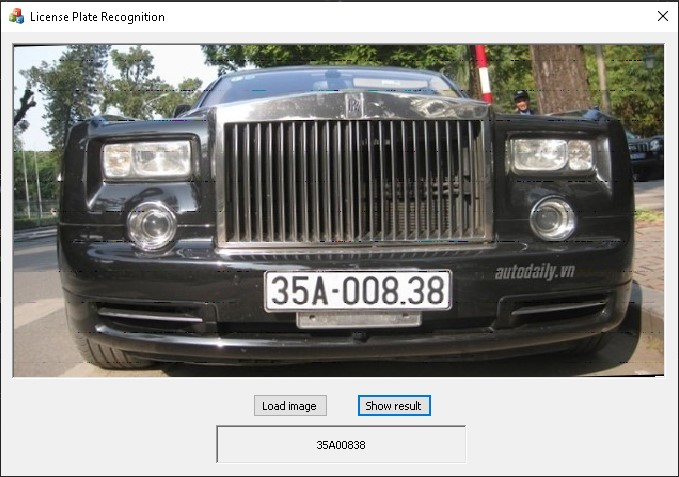
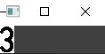
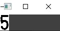
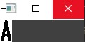
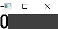
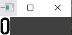
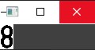
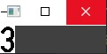
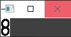

# 🌟 License-Plate-Recognition 🚗🔍

## 🎯 Overview
This project brings to life a **License Plate Recognition** system, powered by **OpenCV in C++** for image processing and **MFC** for a sleek Windows-native UI! 🖥️ It detects and recognizes vehicle license plates from images or videos, making use of OpenCV's awesome computer vision tools and MFC's dialog-based interface to create a seamless user experience. 🚘✨

---

## 📂 Project Structure
- **📜 Header Files** (`header/`): Includes `framework.h`, `License Plate Recognition.h`, `LicensePlateRecognitionDlg.h`, `pdh.h`, `resource.h`, and `targetver.h` for defining core classes and resources. 🗂️
- **💻 Source Files** (`src/`): Contains the magic in files like `License Plate Recognition.cpp`, `LicensePlateRecognitionDlg.cpp`, `pdh.cpp`, and `trainSVM.cpp` for detection, recognition, and SVM training. 🛠️
- **🎨 Resource Files** (`res/`): Stores MFC goodies like `LicensePlateRecognition.ico`, `LicensePlateRecognition.rc`, and `LicensePlateRecognition.rc2` for the UI. 🖼️

---

## 🛠️ Technical Details
- **🔧 OpenCV C++**: Used for image preprocessing, license plate detection, and character segmentation. The SVM model (in `trainSVM.cpp`) is trained to recognize characters with precision! 🎯
- **🖥️ MFC**: Powers a Windows-based GUI, letting users load images/videos, view results, and interact with the system effortlessly. 🖱️
- **✨ Core Functionality**:
  - Detects license plates using contour detection and morphological operations. 🔲
  - Segments characters from the detected plate. ✂️
  - Recognizes characters with a pre-trained SVM model. 🤖
  - Displays results in the MFC dialog interface. 📊

---

## 🚀 Usage
1. Fire up the app through the MFC interface! 🔥
2. Load an image or video with a vehicle license plate. 📸
3. Watch the system detect and display the recognized plate number in the UI. 🖥️
4. Tweak settings (if available) in the MFC dialog for better accuracy. ⚙️

---

## 🖼️ Results

   

  
  
  
  
  
  
  
  

---

## 💡 Notes
- Make sure your input images have good resolution and lighting for the best detection! ☀️
- If needed, retrain the SVM model (`trainSVM.cpp`) with a custom dataset to boost accuracy for specific plate formats. 📈

